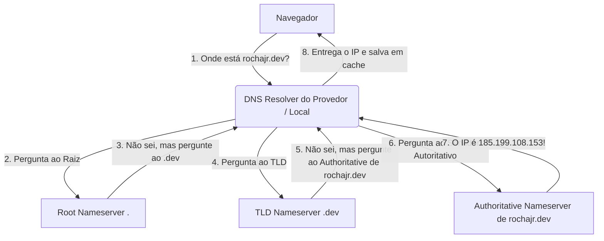

# Como a Web Funciona: O Caminho de uma Requisição

Compreender o funcionamento da infraestrutura sob a qual a internet opera é vital para resolver problemas de performance, configurar servidores com segurança e criar aplicações robustas. Nesta nota de estudos, cobriremos detalhadamente:
1. **O Ciclo de Requisição e Resposta (Request/Response)**
2. **O Processo de Resolução de DNS (Domain Name System)**
3. **Endereçamento IP (IPv4 vs IPv6) e Sub-redes básicas**

---

## 🔄 1. O Ciclo de Requisição e Resposta (Request/Response)

Toda vez que você digita um endereço (URL) no navegador e pressiona *Enter*, um fluxo altamente coordenado de eventos acontece em frações de segundo.

### 🗺️ Fluxo de Alto Nível:

```mermaid
sequenceDiagram
    autonumber
    actor Cliente as Navegador (Cliente)
    participant DNS as Servidores DNS
    participant Servidor as Servidor Web (Ex: Nginx/NestJS)
    
    Cliente->>DNS: Qual é o IP de "rochajr.dev"?
    DNS-->>Cliente: O IP é 185.199.108.153
    
    rect rgb(30, 41, 59)
        Note over Cliente, Servidor: Handshake TCP (3-Way Handshake)
        Cliente->>Servidor: SYN (Sincronizar)
        Servidor-->>Cliente: SYN-ACK (Sincronizar-Confirmar)
        Cliente->>Servidor: ACK (Confirmar)
    end
    
    rect rgb(15, 23, 42)
        Note over Cliente, Servidor: Handshake TLS (Criptografia HTTPS)
    end
    
    Cliente->>Servidor: Requisição HTTP (GET /)
    Note over Servidor: Processamento interno, busca no BD, renderização
    Servidor-->>Cliente: Resposta HTTP (200 OK + HTML/JSON)
    
    Note over Cliente: O navegador lê o HTML, baixa CSS/JS e renderiza a página
```



### 📋 Detalhamento Passo a Passo:

1. **Análise da URL (URL Parsing)**:
   O navegador quebra a URL digitada para identificar:
   - **Protocolo/Esquema**: `https` (seguro) ou `http` (inseguro).
   - **Host/Domínio**: `rochajr.dev`.
   - **Porta**: Oculta na URL (porta padrão `80` para HTTP e `443` para HTTPS).
   - **Caminho (Path)**: `/artigos/como-a-web-funciona`.

2. **Resolução de DNS**:
   O computador precisa do endereço IP numérico do servidor de destino para enviar os pacotes de rede. O sistema operacional consulta o cache local e, se não encontrar, faz uma busca no servidor DNS (detalhado no tópico 2).

3. **Estabelecimento de Conexão (TCP Handshake)**:
   Antes de transmitir dados, o cliente e o servidor estabelecem uma conexão estável e confiável via **TCP** na porta `443`:
   - **SYN**: O cliente envia um pacote com uma flag SYN (Sincronizar) e um número de sequência inicial.
   - **SYN-ACK**: O servidor responde com as flags SYN e ACK (Acknowledge/Confirmar) ativas, indicando que está pronto.
   - **ACK**: O cliente responde com ACK confirmando o recebimento. A conexão está estabelecida!

4. **Negociação de Segurança (TLS Handshake)**:
   Se a conexão for HTTPS, ocorre o handshake TLS (Transport Layer Security) para criptografar a comunicação:
   - Cliente e servidor negociam quais algoritmos de criptografia usar (*cipher suites*).
   - O servidor apresenta seu **Certificado Digital SSL/TLS** para provar sua identidade.
   - Uma chave simétrica é gerada e compartilhada de forma segura para criptografar toda a conversa subsequente.

5. **Envio da Requisição HTTP (Request)**:
   Com o canal seguro aberto, o navegador envia a mensagem HTTP formatada. Exemplo simplificado de uma requisição `GET`:
   ```http
   GET / HTTP/1.1
   Host: rochajr.dev
   User-Agent: Mozilla/5.0 (Windows NT 10.0; Win64; x64)
   Accept: text/html
   Accept-Language: pt-BR,pt;q=0.9
   Connection: keep-alive
   ```

6. **Processamento do Servidor**:
   O servidor web (como Nginx, Apache ou diretamente um servidor NestJS/Node.js) recebe a requisição:
   - Executa a lógica de rotas.
   - Interage com bancos de dados, microsserviços ou sistemas de cache se necessário.
   - Monta um arquivo de resposta (geralmente HTML para páginas ou JSON para APIs).

7. **Envio da Resposta HTTP (Response)**:
   O servidor devolve uma resposta estruturada ao navegador:
   ```http
   HTTP/1.1 200 OK
   Content-Type: text/html; charset=UTF-8
   Content-Length: 12543
   Cache-Control: max-age=3600
   
   <!DOCTYPE html>
   <html>
     <head><title>TechNotes</title></head>
     <body>...</body>
   </html>
   ```

8. **Renderização no Navegador (Critical Rendering Path)**:
   O browser processa a resposta:
   - Faz o parsing do HTML para construir o **DOM** (Document Object Model).
   - Faz o parsing do CSS para construir o **CSSOM** (CSS Object Model).
   - Combina ambos na **Render Tree**.
   - Calcula o layout (tamanho e posição de cada elemento).
   - Pinta (*Paint*) os pixels na tela para o usuário ver o resultado final.

---

## 🗺️ 2. Resolução de DNS (Domain Name System)

O DNS funciona como a **lista telefônica da internet**. Humanos lembram facilmente de nomes (`google.com`), mas os computadores se comunicam através de endereços numéricos (IPs como `142.250.191.46`).

### 🏛️ Estrutura Hierárquica do DNS:

O espaço de nomes do DNS é organizado como uma árvore invertida:

```
                  [ Raiz (Root) ]  --> representado por um "." implícito no fim
                         |
           +-------------+-------------+
           |                           |
        [ .com ]                    [ .br ]        --> TLD (Top-Level Domain)
           |                           |
     [ google.com ]             [ rochajr.com.br ]  --> Domínio de Segundo Nível
           |                           |
  [ www.google.com ]            [ api.rochajr.dev ] --> Subdomínio
```

### 🏃‍♂️ A Jornada de Resolução do DNS (Passo a Passo):

Quando você solicita um IP e a informação não está salva em cache no seu navegador ou sistema operacional, o **DNS Resolver** do seu provedor de internet (ou servidores públicos como `1.1.1.1` da Cloudflare ou `8.8.8.8` do Google) executa a busca recursiva:



### 💾 O Papel do Cache no DNS:
Para evitar sobrecarregar a rede com buscas repetitivas, o DNS faz uso agressivo de cache em múltiplas camadas:
1. **Cache do Navegador**: O browser mantém uma tabela temporária própria.
2. **Cache do Sistema Operacional**: O OS mantém seu próprio cache de DNS resolvidos.
3. **Arquivo `hosts`**: O sistema operacional lê o arquivo de hosts local (ex: `/etc/hosts` no Linux) antes de ir para a internet. Se houver uma entrada estática ali, ela é usada imediatamente.
4. **Cache do Roteador**: O roteador da sua casa também mantém consultas comuns armazenadas.
5. **Cache do Servidor Resolvente (Provedor)**: Guarda a resposta por um tempo determinado pela propriedade **TTL** (Time-To-Live) definida pelo dono do domínio.

### 📝 Principais Tipos de Registros DNS (DNS Records):

*   **A (Address)**: Aponta um domínio para um endereço **IPv4**.
*   **AAAA (IPv6 Address)**: Aponta um domínio para um endereço **IPv6**.
*   **CNAME (Canonical Name)**: Cria um apelido (alias) apontando para outro domínio (ex: `www.seu-site.com` aponta para `seu-site.com`).
*   **MX (Mail Exchanger)**: Especifica os servidores de e-mail responsáveis por receber mensagens destinadas àquele domínio.
*   **TXT (Text)**: Armazena dados textuais arbitrários. Muito utilizado para provar a propriedade de domínios (Google Search Console), além de configurações de segurança de e-mail como **SPF**, **DKIM** e **DMARC**.
*   **NS (Name Server)**: Indica quais são os servidores de nomes autoritativos para aquele domínio.

---

## 🏷️ 3. Endereçamento IP & Sub-redes Básicas

O **Protocolo de Internet (IP)** define as regras para endereçar e encaminhar pacotes de dados através das redes de computadores.

### 🆚 IPv4 vs IPv6

Atualmente convivemos com duas versões ativas do protocolo IP:

| Recurso | IPv4 | IPv6 |
| :--- | :--- | :--- |
| **Tamanho do Endereço** | 32 bits (4 bytes) | 128 bits (16 bytes) |
| **Formato de Exibição** | Decimal em 4 octetos (ex: `192.168.1.50`) | Hexadecimal em 8 blocos (ex: `2001:0db8:85a3:0000:0000:8a2e:0370:7334`) |
| **Quantidade de IPs** | ~4,29 bilhões ($2^{32}$) | ~340 undecilhões ($2^{128}$) |
| **Situação Atual** | Praticamente esgotado (contorna-se com uso de NAT) | Substituição progressiva, espaço infinito de IPs |
| **Segurança** | Suporte opcional (IPsec externo) | Suporte nativo obrigatório (IPsec nativo) |

---

### 🌐 Endereços IP Públicos vs Privados

Nem todos os IPs são acessíveis pela internet global. Existem faixas reservadas pela **RFC 1918** apenas para uso em redes internas (redes locais ou intranets):

*   **Classe A**: `10.0.0.0` até `10.255.255.255` (usada em redes corporativas gigantes).
*   **Classe B**: `172.16.0.0` até `172.31.255.255` (redes de médio porte).
*   **Classe C**: `192.168.0.0` até `192.168.255.255` (redes domésticas e pequenas empresas).

> [!NOTE]
> **NAT (Network Address Translation)**: Como os IPs públicos IPv4 acabaram, os roteadores usam NAT. O roteador recebe um único IP público na internet e distribui IPs privados (como `192.168.1.X`) na rede interna de sua casa. O NAT traduz o tráfego dos dispositivos locais usando diferentes portas, fazendo parecer que todas as requisições vêm daquele único IP público do roteador.

---

### 🧮 Sub-redes Básicas (Subnetting) e Notação CIDR

Uma **sub-rede** é uma subdivisão lógica de uma rede IP maior. Ela permite isolar tráfego, aumentar a segurança (ex: separar servidores de banco de dados dos servidores web públicos) e melhorar o gerenciamento de banda.

#### A Máscara de Rede (Subnet Mask)
A máscara de sub-rede diz quais partes do IP representam a **Identificação da Rede** e quais partes representam o **Host específico (dispositivo)**.
*   Exemplo de IP: `192.168.1.10`
*   Máscara típica: `255.255.255.0`
*   Isso significa que os primeiros três octetos (`192.168.1.`) identificam a **rede**, e o último número (`10`) identifica o **host**.

#### Notação CIDR (Classless Inter-Domain Routing)
Em vez de escrever a máscara de rede inteira (como `255.255.255.0`), a indústria usa a notação CIDR, representada por uma barra seguida pelo número de bits que pertencem à identificação de rede.

Por exemplo: `/24` significa que os primeiros 24 bits da máscara de rede são ativos (`1`). 
$$\text{24 bits} = 8 + 8 + 8 = \text{11111111.11111111.11111111.00000000} \rightarrow 255.255.255.0$$

#### Tabela de Sub-redes Comuns (em IPv4):

| Notação CIDR | Máscara de Rede correspondente | Hosts Disponíveis | Explicação Prática |
| :--- | :--- | :--- | :--- |
| **`/32`** | `255.255.255.255` | 1 | Um único host específico. Comumente usado em regras de firewall. |
| **`/30`** | `255.255.255.252` | 2 | Ideal para links ponto-a-ponto (apenas dois roteadores interligados). |
| **`/28`** | `255.255.255.240` | 14 | Pequenos laboratórios ou microsserviços isolados na nuvem. |
| **`/24`** | `255.255.255.0` | 254 | O padrão para a maioria das redes locais domésticas. |
| **`/16`** | `255.0.0.0` | 65.534 | Redes corporativas grandes ou grandes redes VPCs na nuvem. |

> [!WARNING]
> **Por que subtraímos 2 hosts da contagem?**
> Em qualquer sub-rede, existem dois endereços que não podem ser usados por dispositivos:
> 1. **Endereço de Rede (Primeiro IP)**: Identifica a própria rede (ex: `192.168.1.0` em uma rede `/24`).
> 2. **Endereço de Broadcast (Último IP)**: Usado para transmitir mensagens a todos os dispositivos daquela rede simultaneamente (ex: `192.168.1.255` em uma rede `/24`).
